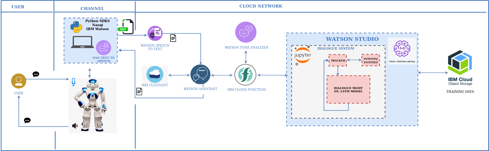

# NAO: A Caring, Emotionally Intelligent Robot

This is the final project of the Northwestern MSR project. This project is an extension of the TJBot project last quarter. The goal is to program a NAO into a caring, emotionally intelligent robot using NAO software and Watson Services. The target audience is intended to be all people who want a companion, entertainment, or a support system during difficult times.

## Project Tracker

 Click [here](./PROGRESS.MD) to view project goals and progress. 

 ## NAO-Watson Framework (IN WORK)

 

 ## General Flow

1. User speaks to NAO.
2. A client python application extracts speech in form of a .wav file. 
3. Python application sends the .wav file to Watson Speech to Text Service.
4. Watson Speech to Text converts the speech to text.
5. Watson Assistant analyzes makes a call to the Watson Tone Analyzer via IBM Cloud function
6. Watson Tone Analyzer analyzes the tone and returns tone back to Watson Assistant via IBM Cloud Function. Note that here it is intented to have Nao light up his eyes based on emotion. 
7. The tone is saved as a context variable and stored in the IBM Cloudant JSON database for tracking the flow of the dialogue. 
8. Watson Assistant makes an additional function call to Watson Studio (Watson's Machine Learning/Data Science Platform) for retrieving conversational response. 
9. Watson Studio trains Machine Learning Model coded in a Jupyter Notebook and using the dialogue training data stored in IBM Cloud Storage. 
10. Watson Studio retrieves intelligent response generated via trained machine learning model. 
11. Watson Studio sends back the response back to Watson Assistant via IBM Cloud Function. 
12. The Watson Assistant API sends the textual response back to the client Python application.
13. The client Python application converts the text to speech via Nao's Text to Speech function. 
14. Nao speaks response to user. 
  * **NOTE**: Conversation ends based on the state of the emotional tone (saved in the Cloudant DB). If For instance, a transition from a sad state to a happy state will trigger an end to the conversation. This is all managed in the dialogue nodes of Watson Assistant. The node flow is primarily driven by contextual variables representing emotional tone. Intents and Entities will be managed via Python Neural Network code in the Jupyter Notebook. 

## Included components

* Python Application including functions to run the NAO robot and connect to Watson Services. Tools included in application are:
  * [Nao-Robot Python-SDK](http://doc.aldebaran.com/2-1/dev/python/index.html): Allows devveloper to create Python modules that can run remotely or on the robot.
  * [Watson Developer Python-SDK](https://github.com/watson-developer-cloud/python-sdk): Client library to use the IBM Watson services in Python and available in pip as watson-developer-cloud

* [Watson-Assistant-Service](https://cloud.ibm.com/apidocs/assistant): The IBM Watson™ Assistant service combines machine learning, natural language understanding, and integrated dialog tools to create conversation flows between your apps and your users.

## Testing Flask with Watson. 

 IBM's voice bot code pattern was used to test integration of Watson services in a web app built on top of JQuery and Python Flask. See demo below. 

 

